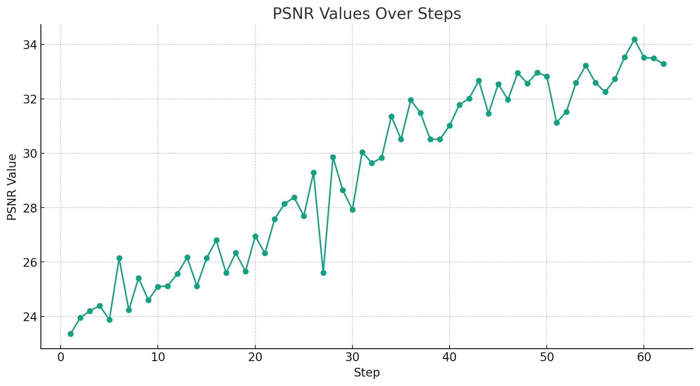
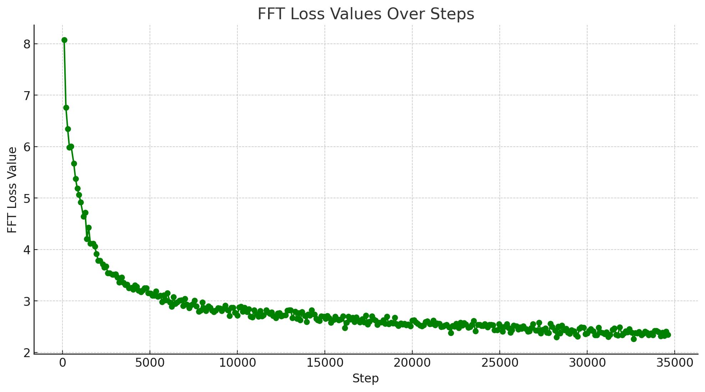
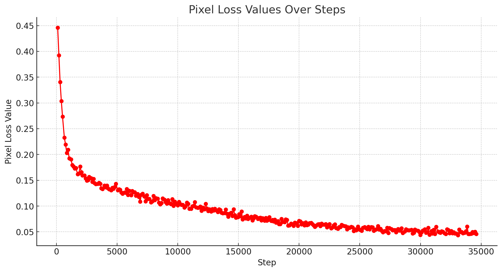
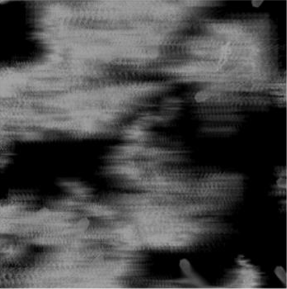
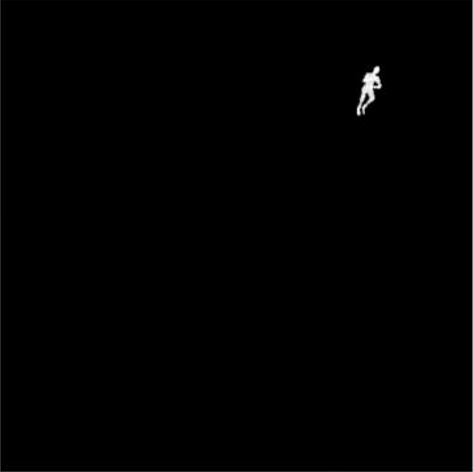

## Introduction

This is a modified version of the original repository [IRNeXt](https://github.com/c-yn/IRNeXt) for the purpose of restoring integral images.
Additional loss values have been added to the original repository to improve the performance of the model.
Also I tried my best to make the process a bit more documented and easier to understand.

## Installation
The project is built with PyTorch 3.8, PyTorch 1.8.1. CUDA 10.2, cuDNN 7.6.5, Tested on Python 3.10.12

We tested with PyTorch + CUDA, if you want to use CPU only, you may need to install a different version of PyTorch for CPU only.

~~~
pip install -r requirements.txt
~~~

Install warmup scheduler:
~~~
cd IRNeXt-main/IRNeXt-main/pytorch-gradual-warmup-lr/ 
python setup.py install
cd ../../ 
Go back to (root directory)
~~~

### Train
~~~
cd IRNeXT-main/Dehazing/OTS
python test.py --mode train --data_dir your_path/dataset

~~~
#### Testing 
~~~
cd IRNeXT-main/Dehazing/OTS
python test.py --data_dir your_path/dataset --test_model path_to_model
~~~

#### Params

Available arguments for testing and training are available in test.py

For training and testing, your directory structure should look like this
Images should be named numeracally only, e.g. 1.png, 2.png, etc ...

`Your path`  
`├──dataset`  
     `├──train`   
          `├──gt`   
          `└──hazy`  
     `└──test`   
          `├──gt`   
          `└──hazy`   

## Results

We achieved PSNR of 34.1 on the test set of the dataset which was a top 5% result in reference to all other project participants. The model was trained around 60 epochs on RTX Titan GPU.

| Image 1 | Image 2 | Image 3 |
|:-------:|:-------:|:-------:|
|  |  |  |
| **PSNR** | **FFT Loss** | **Pixel Loss** |

Example of how the model input and output looked like: 

| Input | Output |
|:-------:|:-------:|
|  |  |

## Contact

Should you have any question, feel free to contact me.